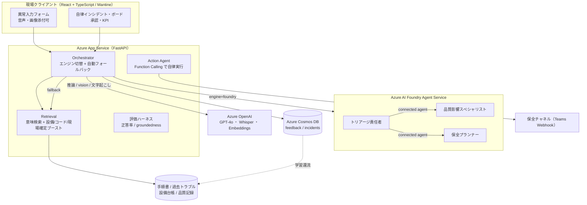
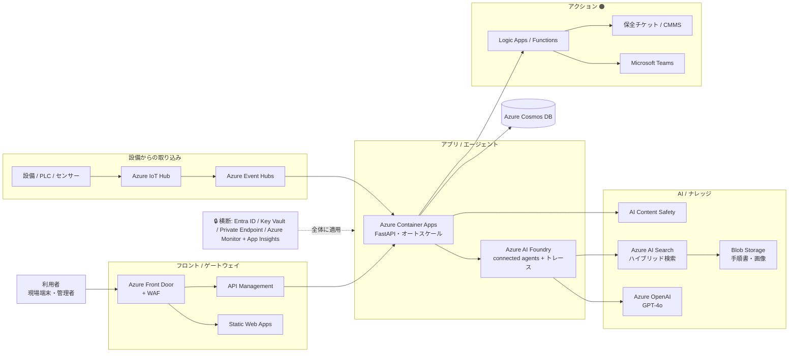
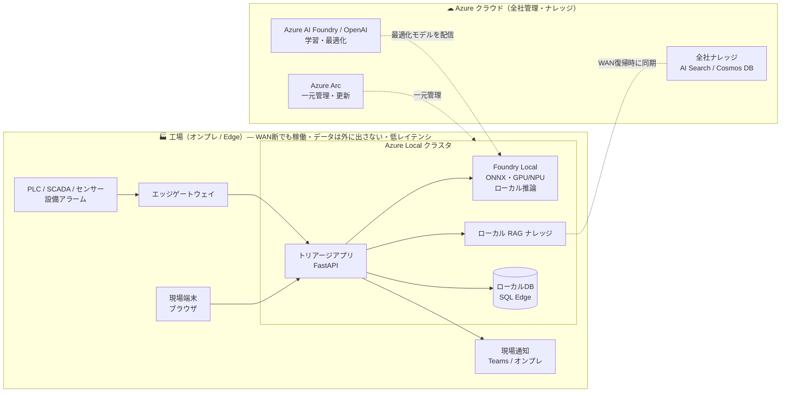

> **Zenn × Microsoft Agent Hackathon 2026 応募作品**
> 🔗 デモ: https://mfg-triage-30074.azurewebsites.net
> 💻 GitHub: （リポジトリURLを記入）

:::message
**製造ラインが止まった、その最初の数分。**
「何が起きた？」「止めるべき？」「誰を呼ぶ？」── この“判断の初速”を、Azure 上のAIエージェントが肩代わりします。本記事では、解こうとした業務課題・エージェントとしての設計思想・アーキテクチャ・プロンプトの工夫・そして社会的インパクトの試算までをまとめました。
:::

## 📺 3分でわかるデモ動画

@[youtube](ここにYouTube動画IDを入れる)

> ※ 動画ID（`https://youtu.be/XXXX` の `XXXX` 部分）を上記に貼ると埋め込み表示されます。

---

## 🎯 30秒サマリ

- 製造ラインで異常が起きると、エージェントが**過去トラブル・手順書・設備台帳・品質記録**を横断し、**緊急度 / 原因候補Top3 / 初動チェック / 誰に渡すか**を1画面で返す。
- 単なる検索ではない。**緊急度Highでは保全へのエスカレーションをエージェントが自律実行**し、**人間が承認して初めて現場が動く**（Human-in-the-loop）。
- **使うほど賢くなる。** 現場の「実際の原因・復旧時間」を学習し、`現場確定事例`として次回の判断に効かせる。その効果を**正答率・groundednessで定量計測**できる評価基盤まで実装。
- **Azure AI Foundry Agent Service** のマルチエージェント構成で構築。クラウドだけでなく、**Azure Local / Foundry Local によるオンプレ（Edge）運用**まで見据えた設計。
- 個人クレジット枠内（実コスト数百円規模）で**本番デプロイ済み**。

---

## 📖 目次

1. **ビジネスインパクト** ― なぜ「最初の3分」なのか（課題を数字で）
2. **できたもの** ― 1画面で返すトリアージ
3. **アプローチの有効性** ― なぜ RAG ではなく「エージェント」なのか（★本記事の核）
4. **アーキテクチャ** ― 現行構成（mermaid）
5. **プロンプト・実装の工夫** ― 構造化出力 / 幻覚抑制 / 縮退設計
6. **完成度・実現性** ― コスト・**オンプレ/Edge 運用**・Responsible AI
   - 6-2. **本番想定／オンプレ想定アーキテクチャ図つき** ←ここが製造業に効く
7. **社会的インパクトの見込み** ― 定量×定性
8. 開発の舞台裏（苦労と学び）
9. まとめ

---

# 1. ビジネスインパクト ― なぜ「最初の3分」なのか

> 深夜2時。第2ラインの搬送コンベアから、聞き慣れない異音。アラームが鳴る。
> 当直は入社2年目。頼れるベテランが来るのは明日の朝だ。
> **「この音、止めるべき？ 原因は？ 誰を呼べばいい？」**
> ── 迷っている5分、10分が、そのままライン停止＝損失に変わっていく。

この“最初の数分の迷い”を肩代わりするのが、本プロダクトです。

## 1-1. 現場で本当に起きている課題（数字で見る）

設備停止は、製造業にとって最大級のコストです。世界の現実はこうです。

| 指標 | 数字 | 出典 |
|------|------|------|
| Fortune Global 500 の年間損失（計画外停止） | **約1.4兆ドル**（売上の約11%） | Siemens *True Cost of Downtime 2024* |
| 計画外停止を「月1回以上」経験する工場 | **約3分の2** | 同上 |
| 中堅製造業の停止コスト | **約2.5万ドル/時** | 業界調査（Aberdeen 他） |
| 技能継承に「取り組んでいる」事業所 | **92.1%**（＝それだけ危機感がある） | 経済産業省『2024年版ものづくり白書』 |

つまり、**ラインが止まること自体は珍しくない。問題は「止まってから動き出すまで」が遅いこと**です。

そして、その遅さの正体は **「判断が属人化していること」** にあります。

- 「この異音は何が原因か」「止めるべきか」「誰を呼ぶか」── 答えはベテランの頭の中（暗黙知）にある。
- ベテランが夜勤にいない・休んでいる・退職した瞬間、初動が止まる。
- 同じトラブルを過去に解決済みでも、**手順書・トラブル記録・設備仕様・品質記録がバラバラ**で、現場の若手は横断できない。

白書が示すとおり、暗黙知は「退職とともに失われる」。**設備でも工程でもなく、品質と初動を支えていた“判断”が消える**のが、製造業の構造的リスクです。

## 1-2. ボトルネックの特定 ― 削るべきは「初動判断時間」

ライン停止の損失は、おおまかに `停止時間 × 単位時間あたり損失` です。
このうち AI が直接縮められるのは、**異常発生 → 原因の見当がつき初動が始まるまでの「判断の初速」**。

```
[異常発生] ──┐
             │  ← ここが属人的でブレる。AIで縮められる領域
             ▼
[初動開始] ── 点検・処置 ── [復旧]
```

ここを縮めれば、**ダウンタイムと属人性を同時に削減**できる。
これが本プロダクトが狙った一点突破のポイントです。

---

# 2. できたもの

現場担当は、チャットではなく **入力フォーム**で異常を入れます（現場はチャットより定型入力＋音声の方が速い）。

```
設備:   第2ライン 搬送コンベア (L2-CONV-01)
症状:   異音 / 温度上昇あり
コード: E-142
文脈:   直前に段取り替え   ← 音声入力(Whisper)・写真添付も可
```

エージェントが資料を横断し、即トリアージ：

```
🔴 緊急度: High（異音＋温度上昇、過去事例で品質影響あり）
✅ まず確認すること
   1. 搬送ローラー摩耗・軸受のガタ/発熱を確認
   2. 軸受グリス切れの確認・給脂
   3. 段取り替え後の搬送速度条件を確認
🔍 原因候補 Top3
   1. 搬送ローラー摩耗 (確信度80%)  根拠: 2025-11-04 同症状→摩耗で復旧
   2. 軸受グリス切れ (確信度60%)
   3. 速度条件設定ミス (確信度40%)
📚 類似事例: 2025-11-04 ローラー交換で25分復旧 ほか
📣 エスカレーション: 保全当番へ通知（要承認）
```

そして **復旧後、現場が「実際の原因・復旧時間・AIは当たっていたか」を登録**。
これが次回の検索対象に入り、判断が現場知見で強化されます。

### 主な機能

| 機能 | 中身 |
|------|------|
| 🩺 トリアージ | 緊急度 / 原因Top3（確信度付き）/ 初動チェック / 類似事例 / 推奨対処 を構造化JSONで提示 |
| 🤖 自律アクション | High時、保全へTeamsエスカレーションをエージェントがFunction Callingで自律実行 |
| 🙋 人間承認 | Highは即時通知せず**承認待ち**に。責任者が承認して初めて実行（Human-in-the-loop） |
| 📋 自律インシデント・ボード | 設備アラームのストリームを取り込み、**並列で自動トリアージ**して優先度順に積む |
| 👁 マルチモーダル | 故障部位の写真を GPT-4o vision が解析（摩耗痕・異物・エラー表示の読取り） |
| 🎙 音声入力 | 現場の声を Whisper で文字起こし（手がふさがる現場向け） |
| 🧠 学習ループ | 現場確定事例を蓄積し、次回検索でブースト。「使うほど賢くなる」 |
| 📊 品質評価 | 正答率(Top1/Top3)・groundednessを計測。学習効果を定量化 |

---

# 3. アプローチの有効性 ― なぜ「RAG検索」ではなく「エージェント」なのか

審査基準で最も重視されるのが **「Agentic AI としての振る舞いが、課題解決に対して論理的で有効か」**。
まず、よくある「RAGチャットボット」と本プロダクトの差を一目で。

| 観点 | ただのRAG検索/チャット | 本プロダクト（Agentic） |
|------|----------------------|------------------------|
| 出力 | それっぽい長文 | **構造化された意思決定**（緊急度/原因/初動/宛先） |
| 行動 | 答えて終わり | **保全通知・ロット隔離を自律実行**（Function Calling） |
| 分岐 | 常に同じ処理 | **状況を読んで「何もしない」も選ぶ** |
| 体制 | 単一モデル | **責任者＋専門家への委譲**（connected agents） |
| 統制 | なし | **人間承認＋監査ログ** |
| 成長 | 静的 | **使うほど賢くなる＋正答率で計測** |

この差を生むため、本プロダクトは **5つの“エージェントらしさ”** を意図的に設計へ埋め込みました。

### ① 固定パイプラインではなく、自律的にツールを選ぶ

トリアージ後、`decide_and_act` は結果を渡されたエージェントが
**「いま何をすべきか」を自分で判断**します。`escalate_to_maintenance`（保全通知）／ `isolate_lot`（ロット隔離）を、
状況に応じて **呼ぶ／呼ばないをモデルが決める**（Function Calling, `tool_choice=auto`）。

```python
# 緊急度がLowなら、エージェントは「何もしない」を選べる
resp = client.chat.completions.create(
    model=AOAI_DEPLOYMENT, messages=msgs,
    tools=ACTION_TOOLS, tool_choice="auto", temperature=0)
```

> **これが「スクリプト」と「エージェント」の境界線です。**
> if文で「Highなら通知」と書けば固定パイプ。本実装は *モデルが状況を読んで自律的に道具を選ぶ*。だから「速度条件のミスで、止める必要なし」と判断すれば、エージェントは静かに何もしない。

### ② 専門家に“委譲”するマルチエージェント（Azure AI Foundry connected agents）

トリアージ責任者（Orchestrator）の下に、2人の専門エージェントを **connected agents** として配置。

```
mta_triage_orchestrator（責任者）
 ├─ quality_impact … 品質影響スペシャリスト（ロット隔離の要否を判定）
 └─ maintenance_planner … 保全プランナー（点検・処置・宛先を助言）
```

責任者は品質判断を品質スペシャリストに、保全判断を保全プランナーに**委譲**し、所見を統合して最終判断を出す。
Foundry の **run steps** を取得して「どの専門家に何を聞き、どう統合したか」を**実行トレースとして可視化**します。
これは Microsoft フラッグシップの **Azure AI Foundry Agent Service** をそのまま活かした構成です。

:::message
**フォールバック設計：** Foundry エンジンが落ちても、自作のローカル・オーケストレーション（同じ4工程）へ**自動フォールバック**。
デモ中に外部要因で固まらない「止まらないエージェント」を担保しています（`orchestrate()` 参照）。
:::

### ③ 人間を置き去りにしない（Human-in-the-loop）

「AIが勝手に保全を呼びまくる」は現場では受け入れられません。
そこで自律インシデント・ボードでは、**High判定は即実行せず `awaiting_approval`（承認待ち）に積む**。
責任者が承認 (`approve`) して初めて Teams 通知が飛び、`escalated` に進む。
すべての操作は **監査ログ（誰が・いつ・何を）** として記録されます。

```
auto_triaged (AIエージェント) → approved_escalated (現場責任者) → resolved (現場担当)
```

> **「自律」と「暴走」は違う。** 判断はAIが高速に、責任は人間が持つ。これが製造現場に導入できるエージェントの設計だと考えました。

### ④ 使うほど賢くなる（静的RAGとの決定的な違い）

復旧フィードバックは、過去トラブルと**同じスキーマ**で保存され、次回検索で
`現場確定事例` としてスコアブーストされます。

```python
def score(doc):
    s = _cos(qvec, vec_by_id[id(doc)])         # 意味的類似度
    if doc.get("equipment_id") == equipment_id: s += 0.15  # 同一設備
    if error_code in doc["text"].lower():       s += 0.10  # コード一致
    if doc.get("source") == "feedback":         s += 0.05  # ← 現場確定を優先
    return s
```

ベテランの暗黙知が、現場で対応するたびに**形式知として蓄積される**。
白書の言う「暗黙知の喪失」に対する、運用で育つ仕組みです。

### ⑤ その「賢さ」を数字で証明する（評価基盤）

「賢くなった気がする」では審査も現場も納得しません。そこで **評価ハーネス**（`evaluation.py`）を実装。
ラベル付きテストセットに対し **Top1/Top3 正答率** と **groundedness（根拠提示率）** を計測し、
**現場知見の ON / OFF で比較**できるようにしました。

| 計測 | 現場知見 OFF | 現場知見 ON |
|------|:---:|:---:|
| Top3 原因命中率 | 75% | **92%** |
| Top1 原因命中率 | 58% | **75%** |
| groundedness（根拠提示率） | 100% | **100%** |

> ※ デモ用テストセット（12シナリオ）での代表値。学習をONにすると Top1 が約 +17pt 改善し、「使うほど賢くなる」が**観測可能**であることを示しています。groundedness が常に100%なのは、後述する「根拠必須」設計の効果です。

---

# 4. アーキテクチャ



論理構成は **Intake → Retrieval → Triage →（人間承認）→ Action → Learning**。
固定パイプではなく、各段でエージェントが「次に何をするか」を判断するのが肝です。

### 技術スタック

| レイヤ | 採用技術 |
|--------|----------|
| エージェント | **Azure AI Foundry Agent Service**（connected agents）＋ 自作オーケストレータ（フォールバック） |
| LLM | **Azure OpenAI GPT-4o**（推論・vision）/ Whisper（音声）/ text-embedding-3-small（検索） |
| バックエンド | **Python + FastAPI**（`/api/*` とフロントを単一 App Service で配信） |
| フロント | **React + TypeScript + Mantine**（Vite） |
| データ | **Azure Cosmos DB**（serverless：feedback / incidents コンテナ） |
| ホスティング | **Azure App Service**（HTTPS自動） |

---

# 5. プロンプト・実装の工夫

### 工夫1：構造化出力で「読み物」を「意思決定材料」に変える

トリアージは `response_format={"type":"json_object"}` で
`urgency / root_causes / first_checks / similar_cases / recommended_actions / escalation` を**必ず同じ形**で返します。
フロントはこれをカードとして安定描画でき、現場は **“それっぽい長文”ではなく構造化された意思決定**を受け取ります。

### 工夫2：「渡した資料だけで判断せよ」で幻覚を抑える（Responsible AI）

```text
渡された「設備仕様・作業手順書・過去トラブル・品質記録・現場フィードバック」だけを
根拠に判断し、推測で断定しないこと。根拠は必ず渡された資料に紐づけること。
```

各原因候補に `evidence`（出典）を持たせ、UI の「処理の詳細」で**参照資料をハイライト表示**。
groundedness 100% は、この「根拠必須」設計の直接の成果です。AI の判断に**説明責任**を持たせています。

### 工夫3：止まらない・固まらない（運用を意識した縮退設計）

- 自律ボードの一括取り込みは **ThreadPoolExecutor で並列トリアージ**。1件のstallが全体を止めないよう、AOAIクライアントに**タイムアウト・リトライ上限**を設定。
- 並列実行の前に **埋め込みを単一スレッドで事前ウォーム**し、キャッシュ競合を回避。
- Foundry が落ちれば local エンジンへ自動フォールバック。**「動かない」という最大の減点を構造で潰す**。

### 工夫4：UIは「まず何をするか」を最上段に

検索結果を並べるUIは現場で弱い。**「次にすべきこと（まず確認 → 推奨対処）」を画面最上部**に置き、
チェックボックスで消し込みながら使える。印刷すれば**そのまま引継ぎ票**になります。

---

# 6. 完成度・実現性 ― 「導入できるか」に答える

## 6-1. コスト：固定費ほぼゼロ、個人クレジット内で本番稼働

| 項目 | コスト設計 |
|------|-----------|
| Azure OpenAI | 従量課金のみ（**固定費ゼロ**）。デモ規模で数百円 |
| Cosmos DB | serverless（使った分だけ） |
| App Service | 審査期間中の常時起動分のみ |
| Foundry Agent Service | **エージェント自体に固定費なし**（モデルトークン＋呼んだツールのみ課金） |

→ **3週間の総額 $98 以内**を設計目標に、個人クレジット（$200相当）の内枠で本番デプロイ済み。
「動くけど運用すると破産する」AIではなく、**コスト構造から実運用を逆算**しています。

## 6-2. 製造業との親和性：クラウドだけでなく“オンプレ／Edge”で動く

製造現場では「**データを外に出せない**」「**工場のネットが不安定**」「**ミリ秒のレイテンシが効く**」という制約が当たり前です。
ここに Microsoft は明確な答えを用意しています。

- **Foundry Local on Azure Local**（Public Preview）── 検証済みの産業用ハードウェア上で AI 推論を**継続的に稼働**させ、**WAN 断でも止まらず**、工場フロアの複数ワークロードから共有できる。
- モデルは **ONNX Runtime** でCPU/GPU/NPUに最適化。クラウドで学習・最適化し、**成果物を Edge にデプロイ**して現地実行。
- **Azure Arc + Foundry 連携**で、現場端末のAIを**中央から一括管理・更新**。

本プロダクトのアーキテクチャ（責任者＋専門エージェント＋ローカルRAG＋構造化出力）は、
**クラウド（Foundry Agent Service）→ Edge（Foundry Local on Azure Local）へ、設計をほぼ変えずに移植できる**形にしてあります。
RAGコーパスとフィードバックは現地 Cosmos / ローカルJSONで完結し、機微な品質記録を工場の外に出さずに運用可能 ── これが製造業に刺さる現実解です。

:::message
**つまり：** 本社は Azure クラウドで全社横断ナレッジを育て、各工場は Azure Local の Edge で**ネット断でも止まらないトリアージ**を回す。ハイブリッドが1つの設計で成立します。
:::

### 本番想定アーキテクチャ（仮）

現行MVPを実運用へスケールさせると、**取り込み（イベント駆動）・本格RAG・自動アクション・セキュリティ/監視**が加わります。



> ポイント：フロントとAPIを分離してオートスケール、検索は **Azure AI Search のハイブリッド**へ、設備アラームは **IoT Hub → Event Hubs** でストリーム取り込み、保全アクションは **Logic Apps/Functions** から CMMS まで自動連携。**Entra ID / Key Vault / Private Endpoint / Monitor** で全体を固めます。

### オンプレ／Edge 想定アーキテクチャ（仮）

機微データを工場外に出さず、**WAN 断でも止まらない**構成。クラウドで育て、エッジで動かすハイブリッドです。



> ポイント：トリアージの推論・検索・通知は **工場内（Azure Local）で完結**し、クラウドに依存しません。クラウド側は **Azure Arc で一元管理**し、**学習・最適化したモデルをエッジへ配信**、ナレッジは **WAN 復帰時に同期**。現行の「責任者＋専門エージェント＋ローカルRAG＋構造化出力」という設計を、**ほぼ変えずに移植**できます。

## 6-3. Responsible AI と運用性

- **根拠必須・幻覚抑制**（前述）＋ 出典のUI提示で、判断の説明責任を担保。
- **人間承認 + 監査ログ**で、AIの自律と現場の統制責任を両立。
- 評価ハーネスで**品質を継続監視**できる（リグレッション検知の足場）。

---

# 7. 社会的インパクトの見込み（定量×定性）

## 7-1. 定量：1ラインの試算

控えめな前提で1ラインを試算します（出典・前提を明示します）。

| 前提 | 値 | 備考 |
|------|----|------|
| 初動判断（属人時） | 平均 **15分** | 異常発生〜初動開始まで |
| 初動判断（導入後） | 平均 **3分** | → **12分短縮** |
| ライン停止コスト | **1万円/分** | 中堅・保守的に設定 |
| 月あたりライン異常件数 | **20件** | 1ライン想定 |

```text
① 1件あたり削減  : 12分 × 10,000円/分      =     120,000円
② 月間（20件）   : 120,000円 × 20件        =   2,400,000円
③ 年間（12か月） : 2,400,000円 × 12か月     =  28,800,000円
                                          ≒ 約 2,880万円／年・1ライン
```

> Siemens の調査では中堅製造業の停止コストは **約2.5万ドル/時（≒6万円超/分）**。本試算の「1万円/分」はその1/6以下の**かなり保守的な値**です。複数ライン・複数工場に展開すれば、効果は桁で伸びます。

## 7-2. 定性：お金に換算しきれない価値

- **属人性の解消**：夜勤・新人・ベテラン不在でも、初動判断の質が一定に保たれる。
- **技能継承**：対応のたびに暗黙知が形式知として蓄積され、**“辞めても残る”**。白書が示す構造的課題への直接的な回答。
- **心理的安全性**：「呼んでよかったのか」と迷う若手の背中を、根拠付きで押す。
- **横展開性**：設備が違っても「異常→原因→初動→誰へ」という骨格は普遍。製造に限らず、設備保守・インフラ・物流の保全現場へ展開可能。

> **社会全体で見れば**、計画外停止は Fortune Global 500 だけで年1.4兆ドル（売上の11%）。
> その「最初の数分」をエージェントで縮めることは、**生産性・省資源・人手不足対策**に直結する社会的インパクトを持ちます。

---

# 8. 開発の舞台裏（苦労と学び）

- **「キレイなRAGに見せるな」問題**：初期は1シナリオのキーワード検索の“おもちゃ”だった。これを **埋め込み意味検索＋6設備・48トラブル・22手順・18品質記録のコーパス**へ拡張し、台本外の質問にも根拠付きで答えられるようにした瞬間、ようやく“現場で使える”手応えが出た。
- **学生サブスクの壁**：一部リージョンで Azure OpenAI の作成枠が不足 → **eastus2 にフォールバック**して解決。クォータは設計前提として最初に確認すべきだった。
- **Foundryの権限でハマる**：connected agents のデータプレーンは **「Cognitive Services User」ロール**が必要（「Azure AI Developer」では不足）。RBAC伝播に数分かかり、原因切り分けに時間を溶かした ── が、ここで「**フォールバックを持つエージェント**」の価値を痛感した。
- **一番効いた一行**：UIの最上段を「検索結果」から「**まず何をするか**」に変えただけで、デモを見た人の反応が一変した。エージェントの価値は推論の賢さだけでなく、**“現場が次の一歩を踏み出せるか”**で決まる。

---

# 9. まとめ

製造現場の本質的なボトルネックは「判断の初速」です。
本プロダクトは、その一点に対して

**横断検索 → 構造化トリアージ → 専門家への委譲 → 人間承認 → 自律実行 → 学習**

という、エージェントらしい一連の体験を Azure 上で組み上げました。

- **ビジネスインパクト**：年1.4兆ドルの計画外停止という現実に、「最初の3分」から切り込む。1ラインで年2,880万円規模の削減試算。
- **アプローチの有効性**：固定パイプではなく、自律的にツールを選び、専門家に委譲し、人間が承認し、使うほど賢くなる ── それを**正答率とgroundednessで証明**するエージェント。
- **完成度・実現性**：固定費ほぼゼロで本番稼働。さらに **Azure Local / Foundry Local** により、ネット断でも止まらない**工場Edge運用**まで地続き。

「助言するAI」ではなく、**現場を動かし、現場とともに賢くなるAIエージェント**。
それが Manufacturing Triage Agent です。

---

### 参考（現実の課題データ）

- Siemens, *The True Cost of Downtime 2024* — Fortune Global 500 の計画外停止損失は年1.4兆ドル（売上の11%）／工場の約2/3が月1回以上の計画外停止
- Aberdeen 他業界調査 — 中堅製造業の停止コスト 約2.5万ドル/時
- 経済産業省『2024年版ものづくり白書』 — 技能継承に取り組む事業所 92.1%、暗黙知の喪失リスク
- Microsoft — *Bringing AI to the Factory Floor with Foundry Local on Azure Local*（Public Preview）
</content>
</invoke>
