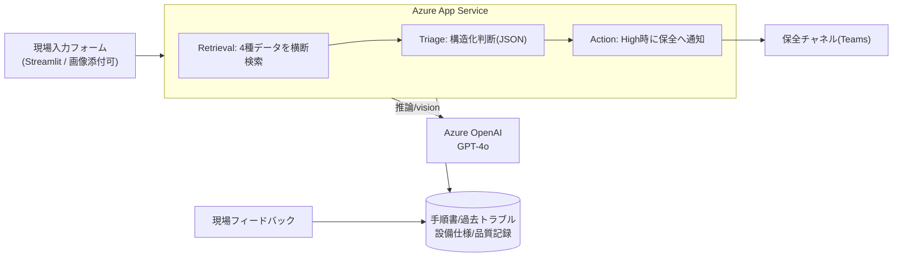

> Zenn × Microsoft Agent Hackathon 2026 応募作品。
> **デモURL**: https://mfg-triage-30074.azurewebsites.net
> **GitHub**: （リポジトリURLを記入）

## 3行でいうと

- 製造ラインで異常が起きたとき、**緊急度・原因候補Top3・初動・誰へ渡すか**を1画面で返すAIエージェント。
- 単なる検索ではなく、High判定時は**保全へエスカレーションをエージェントが自律実行**。現場フィードバックで**使うほど賢くなる**。
- **Azure OpenAI (GPT-4o) + Azure App Service** で構築。個人クレジット内（実コスト数百円規模）で本番デプロイ済み。

## 解こうとした「業務の課題」

製造現場のライン異常対応には、こんな課題があります。

- **初動判断が属人的**。「この異音は何が原因か」「止めるべきか」「誰を呼ぶか」は熟練者の暗黙知に依存。
- **ダウンタイムが高コスト**。判断に迷う数分が、そのままライン停止＝損失に直結（1分あたり数千〜数万円規模のラインも）。
- **過去の知見が埋もれる**。同じトラブルが過去に解決済みでも、手順書・トラブル記録・設備仕様・品質記録がバラバラで横断できない。

つまり「**判断の初速**」がボトルネック。ここをAIエージェントで縮めれば、ダウンタイムと属人性を同時に削れます。

## できたもの（デモ）

現場担当は、チャットではなく**入力フォーム**で異常を入れます（現場はチャットより定型入力の方が速い）。

```
設備:   第2ライン 搬送コンベア (L2-CONV-01)
症状:   異音 / 温度上昇あり
コード: E-142
文脈:   直前に段取り替え
```

エージェントが、過去トラブル・手順書・設備仕様・品質記録を横断して即トリアージ：

```
🔴 緊急度: High（異音＋温度上昇、過去事例で品質影響あり）
✅ まず確認すること
   1. 搬送ローラー摩耗・軸受のガタ/発熱を確認
   2. 軸受グリス切れの確認・給脂
   3. 段取り替え後の搬送速度条件を確認
🔍 原因候補 Top3
   1. 搬送ローラー摩耗 (確信度80%)  根拠: 2025-11-04 同症状→摩耗で復旧
   2. 軸受グリス切れ (確信度60%)
   3. 速度条件設定ミス (確信度40%)
📚 類似事例: 2025-11-04 ローラー交換で25分復旧 ほか
📣 エスカレーション: 保全当番へ通知（High）
```

そして**復旧後、現場が「実際の原因・復旧時間・AIは当たっていたか」を登録**。これが次回の検索対象に入り、エージェントの判断が現場知見で強化されます。

## アーキテクチャ



論理的には **Intake → Retrieval → Triage → (Action) → Learning** のエージェント構成です。
緊急度に応じて Action（エスカレーション）を**呼ぶ/呼ばないをエージェントが判断**する点が、単なる固定パイプラインとの違いです。

## 技術的な工夫

### 1. 構造化出力でUIを安定させる
Triageは Azure OpenAI の JSON 出力（`response_format`）で
`urgency / root_causes / first_checks / similar_cases / recommended_actions / escalation` を必ず同じ形で返します。これでフロントはカードを安定描画でき、"それっぽい長文"ではなく**意思決定に使える構造**になります。

### 2. 根拠に紐づけ、幻覚を抑える
システムプロンプトで「**渡された資料だけを根拠に判断し、推測で断定しない**」を強制。各原因候補に `evidence`（出典）を持たせ、根拠画面で参照資料を提示します（Responsible AIの観点）。

### 3. 使うほど賢くなる学習ループ
フィードバックは過去トラブルと同じスキーマで保存し、次回検索で**「現場確定事例」として優先**。静的RAGではなく、運用で育つ設計です。

### 4. マルチモーダル
故障部位の写真を添付すると GPT-4o vision が所見（摩耗痕・異物・エラー表示）を読み取り、判断に反映します。

## コスト（学生サブスクリプションで完結）

- **Azure OpenAI**: 従量課金（固定費ゼロ）。デモ規模では数百円。
- **Azure App Service (B1)**: 審査期間中の常時起動分のみ。
- いずれも個人クレジット（$100相当）の範囲に十分収まります。

## 苦労した点 / 学び

- 学生サブスクリプションは一部リージョンでAzure OpenAIの作成枠が不足 → **eastus2にフォールバック**して解決。
- Streamlit を App Service で動かすには **起動コマンドと `WEBSITES_PORT=8000` の明示**が必須（デフォルトのgunicorn起動では立ち上がらない）。
- 「検索結果を並べる」UIは弱い。**最上部に"まず何をするか"** を置くだけで、現場で使える感が一気に出る。

## 今後の発展

- Azure AI Foundry Agent Service の **connected agents** へ移行し、Intake/Retrieval/Triage/Learning を明示的なマルチエージェントに。
- Azure AI Search による本格的なハイブリッド検索（大規模文書対応）。
- IoT/設備データ連携で「異常の予兆」検知まで。

## まとめ

「判断の初速」という製造現場の本質的な課題に対し、**横断検索 → 構造化トリアージ → 自律エスカレーション → 学習**までを1つのエージェント体験にまとめました。Azureだけで、低コストで、実際に動くものとして提出しています。
