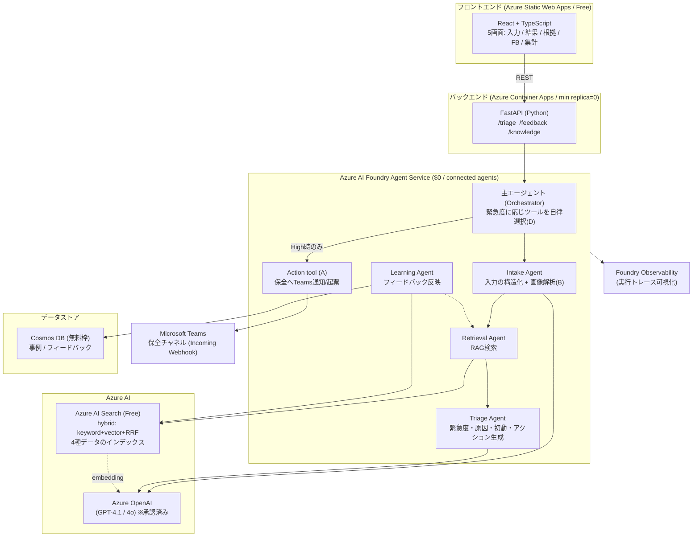

# 02. Azure アーキテクチャ

## システム構成図

## サービス選定と理由

### エージェント基盤：Azure AI Foundry Agent Service

- **サービス自体に追加課金なし**。課金はモデルトークン + 呼び出したツールのみ。固定費ゼロで $98 制約に収まる。
- **connected agents** で「主エージェント → 専門サブエージェント」を自前オーケストレータなしに構成できる。
  → マルチエージェント設計が構成として成立し、審査での「ちゃんとエージェントしてる」が伝わる。
- **Foundry Observability** が実行トレース（モデル呼び出し・ツール呼び出し・判断・レイテンシ・コスト）を
  ポータルで可視化。デモの「見せ方」に直結する強力な資産。
- 主催が Microsoft であり、フラッグシップの Agent 基盤を使うこと自体が加点シグナル。
- 詳細なエージェント分割は [03-agent-design.md](./03-agent-design.md)。

### LLM：Azure OpenAI

- 既にサブスクリプションで承認済み（クォータ確保済み）。3日MVPの最大リスクが既に解消。
- 埋め込み（embedding）も AOAI のモデルを使い、AI Search のベクトル生成に利用。

### RAG 検索：Azure AI Search（Free tier）

- **Free tier を採用**。Basic（~$51/3週間）は予算の半分を食うため避ける。
- **hybrid 検索**（キーワード + ベクトル + RRF 統合）で実装。
- Free tier の制約：セマンティックランカー（再ランキング）が使えない、50MB 上限。
  → AI 生成の小規模データなら品質十分。citation（該当箇所）はそのまま根拠画面に使える。

### バックエンド：FastAPI on Azure Container Apps

- **min replica = 0（scale-to-zero）** + 無料付与枠で、デモ期間中ほぼ $0。
- コールドスタートはデモ用途では許容。
- Docker でコンテナ化し、`az containerapp up` もしくは azd でデプロイ。

### フロントエンド：React + TypeScript on Azure Static Web Apps

- Free プランで $0。フォーム中心の UI に適する。
- Vite + React + TypeScript で構築。

### データストア：Cosmos DB（無料枠）

- 事例・フィードバックを保存。スキーマ自由で MVP に適する。
- 無料枠（1000 RU/s + 25GB）で $0。

### 加点要素のインフラ（入賞強化）

- **A. アクション実行（Teams 通知）**：保全チャネルの **Teams Incoming Webhook** をバックエンドから呼ぶ（固定費 $0）。
  発展形は Foundry の action tool として **Logic Apps / Azure Functions** を登録し、Agent が自律的に起動。
- **B. 画像解析（GPT-4o vision）**：入力画像を AOAI の vision 対応モデルへ渡す。追加リソース不要・トークンのみ。
- これらは $98 予算を脅かさない（A=$0、B=トークン微増）。

## リージョン方針

- **AOAI が承認済みのリージョンに、AI Search / Container Apps を寄せる**（レイテンシ・整合性のため）。
- 想定：Japan East（確定はユーザー確認待ち）。

## デプロイ手段

- `azd`（Azure Developer CLI）を導入予定（`brew install azd`）。`infra/` に Bicep を置き `azd up` で一括。
- もしくは `az containerapp up`（バックエンド）+ Static Web Apps CLI（フロント）の併用。
