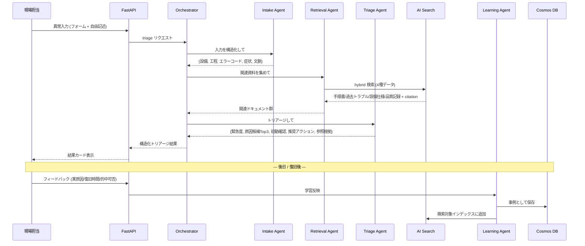

# 03. エージェント設計

## 方針

論理的に **4 エージェント**に分割する。Azure AI Foundry Agent Service の **connected agents** を使い、
主エージェント（Orchestrator）が専門サブエージェントへ委譲する形にする。
3日MVPでは凝りすぎず、まず一直線のフロー（Intake → Retrieval → Triage）を確実に動かす。



## 各エージェントの責務

### 1. Intake Agent — 入力の構造化

- 入力（フォーム値 + 自由記述）を構造化 JSON に整理する。
- 出力例：
  ```json
  {
    "equipment_id": "L2-CONV-01",
    "equipment_name": "第2ライン 搬送コンベア",
    "process": "搬送",
    "error_code": "E-142",
    "symptom_category": "異音",
    "context": "直前に段取り替えあり / 温度上昇あり",
    "free_text": "搬送部から異音"
  }
  ```
- 自由記述からエラーコードや設備名を推定・正規化する役割も担う。
- **(加点B) 画像が添付された場合は GPT-4o vision で解析**し、`image_findings`（摩耗痕・異物・エラー表示の読取り等）を構造化結果に加える。

### 2. Retrieval Agent — 関連資料の収集

- Intake の構造化結果をクエリに、Azure AI Search で **hybrid 検索**。
- 4 種のデータを横断：**手順書 / 過去トラブル / 設備仕様 / 品質記録**。
- 各ヒットに citation（出典・該当箇所）を保持し、根拠画面に渡せるようにする。

### 3. Triage Agent — 判断生成（最重要）

- 収集情報から以下を**構造化出力**で生成（後述スキーマ）：
  - 緊急度（High / Medium / Low）+ 判断理由
  - 原因候補トップ3（候補 / 根拠 / 確信度）
  - 最初に確認すべき手順（順序つき）
  - 推奨アクション + エスカレーション先（誰へ渡すか）
  - 参照した根拠（citation 一覧）
- **構造化出力（JSON schema 強制）**で UI が安定して描画できるようにする。

### 3.5 Action（加点A）— 自律的なエスカレーション実行

- Triage の結果、**緊急度 High または品質影響ありと判断したとき**、Orchestrator が **escalation tool を自律的に呼ぶ**（固定パイプではなく、判断で呼ぶ＝加点D）。
- tool 実体：**Teams Incoming Webhook**（保全チャネル）へ通知。内容は 設備 / 症状 / 緊急度 / 原因候補Top3 / 推奨初動 / 結果リンク。
- Low の場合は呼ばない。＝「Agent が状況に応じて行動を選ぶ」ことを示す。
- これにより「助言」で終わらず、業務を**動かす**（テーマ「解決」への直接応答）。

### 4. Learning Agent — フィードバック反映

- 現場担当のフィードバック（実原因 / 実施対処 / 復旧時間 / AI的中可否 / メモ）を受け取る。
- Cosmos DB に事例として保存し、AI Search のインデックスにも追加。
- 次回の Retrieval で「確定済みの実績事例」として検索対象になる ＝ 使うほど賢くなる。

## Triage 構造化出力スキーマ（案）

```json
{
  "urgency": { "level": "High|Medium|Low", "reason": "string" },
  "root_causes": [
    { "rank": 1, "cause": "string", "evidence": "string", "confidence": 0.0 }
  ],
  "first_checks": [
    { "order": 1, "action": "string" }
  ],
  "recommended_actions": ["string"],
  "escalation_to": "string",
  "escalation": {
    "should_notify": true,
    "channel": "保全 (Teams)",
    "notified": false,
    "message": "string"
  },
  "image_findings": "string|null",
  "similar_cases": [
    { "title": "string", "date": "string", "cause": "string", "recovery_minutes": 0, "note": "string" }
  ],
  "citations": [
    { "source_type": "procedure|past_trouble|equipment_spec|quality_record",
      "doc_id": "string", "highlight": "string" }
  ]
}
```

## トレース（デモ資産）

- Foundry Observability で各エージェントのステップ実行を可視化。
- デモでは「Intake がこう構造化 → Retrieval がこの資料を引き → Triage がこう判断」を
  トレース画面で見せ、"ちゃんとエージェントが動いている"を訴求する。
- Foundry は Microsoft Agent Framework / Semantic Kernel とも標準統合しており、
  将来ロジックをそれらで書いてもトレースはそのまま使える（MVP では Foundry 標準で十分）。
